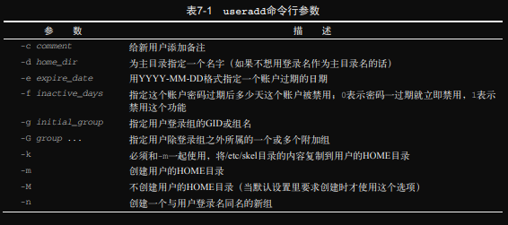
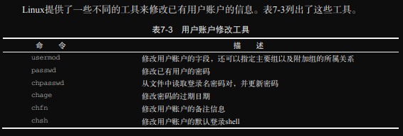
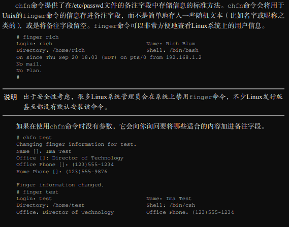
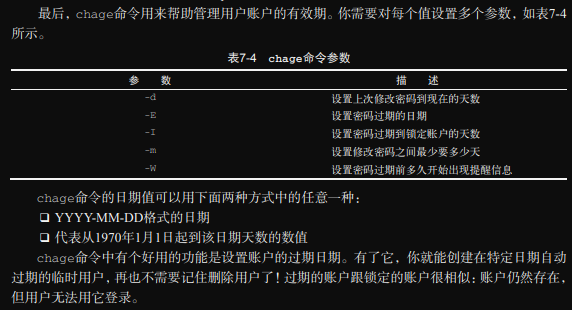
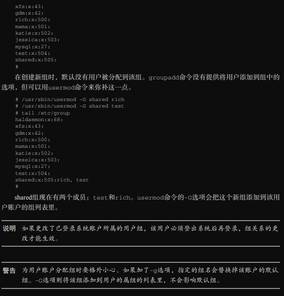
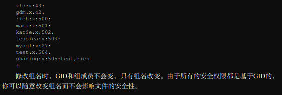
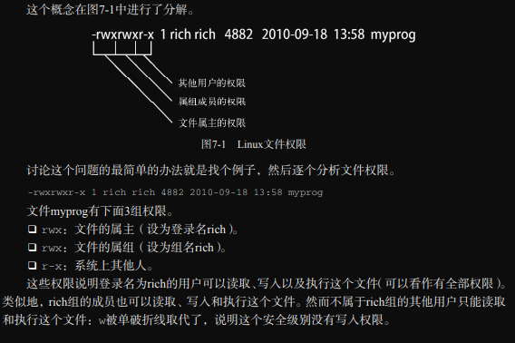
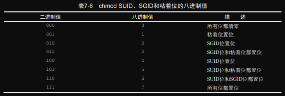

# ch07 理解Linux文件权限

Linux系统沿用了Unix文件权限的做法，允许用户和组根据每个文件和目录的安全性设置来访问文件。本章将讨论如何根据需要利用Linux文件安全系统来保护数据。  

## 1. Linux安全性

Linux安全系统的核心是 **用户账户**。每个能访问Linux系统的用户都会被分配一个唯一的用户账户。用户对系统中各种对象的访问权限取决于他们登录系统时所用的账户。  
用户权限是通过创建用户时的分配的 **用户ID（user ID，UID）** 来跟踪的。UID是个数值，每个用户都有一个唯一的UID。但用户在登陆系统时是使用 **登录名（login name）** 来代替UID登录的。登录名是用户用来登录系统的 **最长8字符** 的字符串（字符可以是数字或字母），同时会关联一个对应的密码。  
本节将介绍管理用户帐户所需要的文件和工具。  

### *1./etc/passwd 文件*

Linux系统使用一个专门的文件 */etc/passwd* 来匹配登录名与对应的UID值。该文件包含了一些与用户有关的信息。

```bash
lxc@Lxc:~/scripts/ch07$ cat /etc/passwd
root:x:0:0:root:/root:/bin/bash
daemon:x:1:1:daemon:/usr/sbin:/usr/sbin/nologin
......
lxc:x:1000:1000:Lxc,,,:/home/lxc:/bin/bash
......
```

文件内容很长，我们做了部分删减。root用户账户是系统的管理员，为其固定分配的UID是0。如你所见，Linux系统会为各种各样的功能创建不同的用户账户，而这些账户并非真正的人类用户。我们称其为 **系统账户**，它们是系统中运行的各种服务进程访问资源使用的特殊账户。所有运行在后台的服务都需要通过一个系统用户帐户登录到Linux系统中。  
Linux为系统账户预留了500以下的UID。有些服务甚至要用特定的UID才能正常工作。为普通用户创建账户时，大多数Linux系统会从500开始，将第一个可用UID分配给这个账户。（并非所有的Linux发行版都是这样，比如Ubuntu就是从1000开始的。）  

*/etc/passwd* 文件中各个字段（字段分隔符为冒号）的含义如下：

- 登录用户名
- 用户密码
- 用户帐户的UID（数字形式）
- 用户帐户的组ID（数字形式）
- 用户帐户的文本描述（称为备注字段）
- 用户$HOME目录的位置
- 用户的默认shell

*/etc/passwd* 文件的密码字段都被设置为x，这可不是说所有的用户帐户都使用相同的密码。在早期的Linux系统中，*/etc/passwd* 文件包含经过加密的用户密码。但鉴于很多程序要从这个文件中获取用户信息，这在某种程度上成了一个安全问题。随着可以轻松破解加密密码的软件的出现，那些居心不良的人试图破解保存在 */etc/passwd* 中的密码时可谓如鱼得水。Linux开发者重新考虑了这一策略。现在，绝大多数Linux系统将用户密码保存在单独的文件中（称为shadow文件，位于 */etc/shadow*）只有特定的程序才能访问该文件。  
如你所见，*/etc/passwd* 是一个标准的文本文件。你可以使用任何文本编辑器直接在其中手动用户管理（比如添加、修改或删除用户帐户），但这样做极其危险。如果 */etc/passwd* 文件受损，系统无法读取文件内容，则会导致用户（即便是root用户）无法正常登录。选择标准的Linux用户管理工具来执行这些用户管理任务会安全很多。

### *2. /etc/shadow 文件* 

*/etc/shadow* 文件对Linux系统密码管理提供了更多的控制。只有root用户才能访问 */etc/shadow* 文件，这使其相比 */etc/passwd* 文件安全许多。

*/etc/shadow* 文件为系统中的每个用户都保存了一条记录。

```bash
lxc:$6$bkKjxqw72Br.mk5YQ.NYnvLShA8L/yH7iDGJbT1:19263:0:99999:7:::
```

该文件每条记录都包含9个字段（同样使用冒号作为字段分隔符）。

1. 登录名
2. 加密后的密码
3. 自上次修改密码后已经过去的天数（从1970年1月1日开始计算）
4. 多少天后才能更改密码
5. 多少天后必须更改密码
6. 密码过期前提前多少天提醒用户更改密码
7. 密码过期后多少天禁用用户帐户
8. 用户帐户被禁用的日期（以从1970年1月1日到当时的天数表示）
9. 预留给以后使用的字段

有了shadow密码系统，Linux系统就可以更好地控制用户密码了，比如控制用户多久更改一次密码，以及如果密码未更新的话，什么时候禁用账户。

### *3. 添加新用户*

添加新用户的主要工具是 `useradd`。该命令可以一次性轻松创建新用户账户并设置用户的$HOME目录结构。`useradd` 命令使用系统的默认值以及命令行参数来设置用户账户。要想查看所使用的Linux发行版的系统默认值。可以使用加了 `-D` 选项的 `useradd` 命令。  

```bash
lxc@Lxc:~/scripts/ch07$ useradd -D
GROUP=100
HOME=/home
INACTIVE=-1
EXPIRE=
SHELL=/bin/sh
SKEL=/etc/skel
CREATE_MAIL_SPOOL=no
```

> **注意：** `useradd` 命令的默认值使用 */etc/default/useradd* 文件设置。另外，进一步的安全设置在 */etc/login.defs* 文件中设置。你可以调整这些文件，改变Linux系统默认的安全行为。

这些默认值的含义如下：

- 新用户会被添加到GID为100的公共组
- 新用户的主目录会位于 /home/*loginname*
- 新用户的账户密码在过期后不会被禁用
- 新用户账户不设置过期日期
- 新用户账户将 /bin/sh 指向的shell作为默认shell
- 系统会将 /etc/skel 目录的内容复制到用户的 $HOME 目录
- 系统不会为该用户账户在mail目录下创建一个用于接收邮件的文件

`useradd` 命令允许管理员创建默认的$HOME目录配置，然后将其作为创建新用户$HOME目录的模板。这样就能自动在每个新用户的$HOME目录里放置默认的系统文件了。在Ubuntu系统中，/etc/skel目录包含以下文件：

```bash
lxc@Lxc:~$ ls -al /etc/skel
总用量 32
drwxr-xr-x   3 root root  4096 10月 30 11:08 .
drwxr-xr-x 150 root root 12288 11月 25 21:22 ..
drwxr-xr-x   2 root root  4096 10月 18 20:50 模板
-rw-r--r--   1 root root   220 2月  25  2020 .bash_logout
-rw-r--r--   1 root root  3771 2月  25  2020 .bashrc
-rw-r--r--   1 root root   807 2月  25  2020 .profile
```

根据第6章的内容，你应该知道这些文件是做什么的。它们是bash shell环境的标准启动文件。系统自动将这些默认文件复制到你创建的每个用户的$HOME目录。

要想在创建新用户时改变默认行为，可以使用相应的命令行选项，如表7-1所示。




### *4. 删除用户*

如果想从系统中删除账户，`userdel` 命令可以满足这个需求。在默认情况下，`userdel` 命令只删除/etc/passwd和/etc/shadow文件中的用户信息，属于该账户的文件会被保留。  
如果加入 `-r` 选项，则 `userdel` 命令会删除用户的$HOME目录以及邮件目录。然而，系统中仍可能存有已删除用户的其他文件。这在有些环境中会造成问题。

```bash
root@Lxc:/home/lxc/scripts/ch07# userdel -r test1
userdel: test1 邮件池 (/var/mail/test1) 未找到
# 因为注册test1账户时并没有创建mail目录，所以在删除时，其邮件池也未找到。
```

> **警告：** 在有大量用户的环境中使用 `-r` 选项要特别小心。你永远不知道用户是否在个人的\$HOME目录中存放了其他用户或程序要用到的重要文件。在删除用户的\$HOME目录之前一定要检查清楚。

### 5. 修改用户



每种工具都提供了特定的功能来修改用户账户信息。接下来将介绍这些工具。

#### *1. `usermod`*

`usermod` 命令是用户账户修改工具中最强大的一个，提供了修改/etc/passwd文件中大部分字段的相关选项，只需指定相应的选项即可。大部分选项与 `useradd` 命令选项一样（比如，`-c` 用于修改备注字段，`-e` 修改过期日期，`-g` 修改默认的登录组）。除此之外，还有另外一些也许能派上用场的选项。

- -l ：修改用户帐户的登录名
- -L ：锁定账户，禁止用户登录。
- -p ：修改账户密码
- -U ：解除锁定，恢复用户登录

`-L` 选项尤为实用。该选项可以锁定账户，使用户无法登录，无须删除账户和用户数据。要恢复账户，只需使用 `-U` 选项即可。

#### *2. `passwd` 和 `chpasswd`*

`passwd` 命令可以方便的修改用户密码：


如果只使用 `passwd` 命令，则修改的是你自己的密码。系统中的任何用户都能修改自己的密码，但只有root用户才有权限修改别人的密码。  
`-e` 选项可以强制用户下次登陆时修改密码。你可以先给用户设置一个简单的密码，之后强制用户在下次登陆时改成他们的密码。  

如果需要为系统中的大量用户修改密码，那么 `chpasswd` 命令可以助你事半功倍。`chpasswd` 命令可以从标准输入自动读取一系列以冒号分隔的登录名和密码对偶（login name and password pair），自动对密码加密，然后为用户帐户设置密码。你也可以重定向命令将包含 *username:password* 对偶的文件重定向给该命令。  

```bash
root@Lxc:/home/lxc/scripts/ch07# chpasswd < users.txt
root@Lxc:/home/lxc/scripts/ch07#
```

#### *3. `chsh`、`chfn` 和 `chage`*






## 2. 使用Linux组

组权限允许多个用户对系统对象（比如文件、目录或设备等）共享一组权限。  
Linux发行版在处理默认组的成员关系时略有差异。有些Linux发行版会创建一个组，将所有用户都作为该组成员。遇到这种情况要特别小心，因为你的文件有可能对于其他用户也是可读的。有些发行版会为每个用户创建一个单独的组，这样会更安全一点。  
每个组都有唯一的GID，和UID类似，该值在系统中是唯一的。除了GID，每个组还有一个唯一的组名。Linux系统中有一些组工具可用于创建和管理组。

### *3. /etc/group 文件*

与用户账户类似，组信息也保存在一个文件中。/etc/group 文件包含系统中每个组的信息。

```bash
lxc@Lxc:~/scripts/ch07$ cat /etc/group
root:x:0:
daemon:x:1:
bin:x:2:
......
```

/etc/group 文件的4个字段分别是：

- 组名
- 组密码
- GID
- 属于该组的用户列表

与UID类似，GID在分配时也采用了特定的格式。对于系统账户组，为其分配的GID低于500，而普通用户组的GID则从500开始分配（有的发行版是1000）。  
组密码允许非组内成员使用密码临时性的成为该组成员。这个功能用的不多，但确实存在。  
同样，/etc/group 文件是一个文本文件。手动编辑出现错误时可能会损坏文件，引发系统故障。更安全的做法是使用 `usermod` 命令（参见[7.1.5节](./README.md#5-修改用户)）。

> **注意：** 用户帐户列表多少有些误导人。你会发现列表中的有一些组没有任何用户。这并不是说这些组没有成员。当一个用户在 /etc/passwd 文件中指定某个组作为主要组时，该用户不会作为该组成员再出现在 /etc/group 文件中。多年了被这个问题困扰的系统管理员可不止一两个。

### *2. 创建新组*




### *3. 修改组*




## 3. 理解文件权限

`ls` 命令可以查看Linux系统中的文件、目录和设备的权限。

```bash
lxc@Lxc:~/scripts/ch07$ ls -l
总用量 680
-rw-rw-r-- 1 lxc lxc  91572 11月 27 14:34 chage.png
-rw-rw-r-- 1 lxc lxc  12099 11月 27 15:08 README.md
......
```

- \-  代表文件
- d 代表目录
- l 代表链接
- c 代表字符设备
- b 代表块设备
- p 代表具名管道
- s 代表网络套接字

之后的三组三字符的编码。每一组定义了3种访问权限。

- r 代表对象是可读的
- w 代表对象是可写的
- x 代表对象是可执行的

如果没有某种权限，则在该权限位会出现连字符。  
这三组权限分别对应对象的三个安全级别。

- 对象的属主
- 对象的属组
- 系统的其他用户



### *2. 默认文件权限*

`umask` 命令用来设置新建文件和目录的默认权限。`umask` 命令可以显示和设置默认权限：

```bash
lxc@Lxc:~/scripts/ch07$ umask
0022
```

其中四位数字中的第一个数位代表了一项特别的安全特性，在 [7.5节](./README.md#5-共享文件) 会详述。接下来三个数位表示文件或目录对应的umask八进制值。比如664代表属主和属组成员都有读取和写入的权限。而其他用户只有读取的权限。  
umask只是个掩码，它会屏蔽掉不想授予该安全级别的权限。要把umask值从对象的全权限值减掉。剩下的是对象的权限。对文件而言，全权限值是666（所有用户都有读取和写入的权限）；对目录而言全权限值是777（所有用户都有读取、写入和执行的权限，对于目录而言，目录的执行权限就是进入该目录）。  所以，在上面的例子中，文件一开始的权限是666，减去掩码umask的值022之后，剩下的文件权限就变成了664。  

umask的值通常会被设置在 /etc/profile 文件中，你可以使用 umask 命令指定其他的umask默认值。当然，该指定在shell退出后就会失效，你可以更改 /etc/profile 文件中的值来持久化。

```bash
lxc@Lxc:~/scripts/ch07$ umask
0002
lxc@Lxc:~/scripts/ch07$ umask 026
lxc@Lxc:~/scripts/ch07$ touch newfile1
lxc@Lxc:~/scripts/ch07$ ls -l newfile1 
-rw-r----- 1 lxc lxc 0 11月 27 15:31 newfile1
lxc@Lxc:~/scripts/ch07$ umask
0026
lxc@Lxc:~/scripts/ch07$ mkdir newdir
lxc@Lxc:~/scripts/ch07$ ls -ld newdir/
drwxr-x--x 2 lxc lxc 4096 11月 27 15:35 newdir/
```

## 4. 更改安全设置

本节将介绍如何修改文件和目录的已有权限、默认属主以及默认属组。

### *1. 修改权限*

`chmod` 命令可以修改文件和目录的安全设置。该命令的格式如下：

```bash
chmod options mode files
```

*mode* 参数允许使用八进制模式或符号模式来进行安全设置。  
八进制模式设置非常直观，直接用打算赋予文件的标准3位八进制权限编码即可。

```bash
lxc@Lxc:~/scripts/ch07$ chmod 760 newfile 
lxc@Lxc:~/scripts/ch07$ ls -l newfile 
-rwxrw---- 1 lxc lxc 0 11月 27 15:51 newfile
```

符号模式指定权限的格式如下：

```bash
[ugoa...][[+-=][rwxXstugo...]]
```

第一组字符指定了定义权限作用的对象。

- u 代表用户
- g 代表组
- o 代表其他用户
- a 代表上述所有

接下来的符号表示你想在现有的权限基础上：增加权限（+）、移除权限（-），还是设置权限（=）。  
最后，第三个符号代表要设置的权限。你会发现，可取的值要比通常的rwx多。这些额外值如下。

- X 仅当对象是目录或者已有执行权限时才赋予执行权限
- s 在执行时设置SUID或SGID
- t 设置粘滞位(sticky bit)
- u 设置属主权限
- g 设置属组权限
- o 设置其他用户权限

*来个例子：*

```bash
lxc@Lxc:~/scripts/ch07$ chmod o+r newfile 
lxc@Lxc:~/scripts/ch07$ ls -l newfile 
-rwxrw-r-- 1 lxc lxc 0 11月 27 15:51 newfile
lxc@Lxc:~/scripts/ch07$ chmod u-x newfile
lxc@Lxc:~/scripts/ch07$ ls -l newfile 
-rw-rw-r-- 1 lxc lxc 0 11月 27 15:51 newfile
```

*options* 为 `chmod` 命令提供了额外的增强特性。`-R` 选项能够以递归的方式修改文件或目录的权限。你可以使用通配符指定多个文件名，然后用单个命令批量修改权限。

### *2. 改变所属关系*

`chown` 命令用来修改文件的属主; `chgrp` 命令用来修改文件的默认属组。

`chown` 的命令格式如下：

```bash
chown options owner[.group] file
```

可以使用登录名或UID来指定文件的新属主：

```bash
root@Lxc:/home/lxc/scripts/ch07# ls -l newfile 
-rw-rw-r-- 1 lxc lxc 0 11月 27 15:51 newfile
root@Lxc:/home/lxc/scripts/ch07# chown test newfile 
root@Lxc:/home/lxc/scripts/ch07# ls -l newfile 
-rw-rw-r-- 1 test lxc 0 11月 27 15:51 newfile
```

也支持同时修改文件的属主和属组：

```bash
root@Lxc:/home/lxc/scripts/ch07# chown lxc.test newfile 
root@Lxc:/home/lxc/scripts/ch07# ls -l newfile 
-rw-rw-r-- 1 lxc test 0 11月 27 15:51 newfile
```

也可以只修改文件的默认属组：

```bash
root@Lxc:/home/lxc/scripts/ch07# chown .lxc newfile
root@Lxc:/home/lxc/scripts/ch07# ls -l newfile 
-rw-rw-r-- 1 lxc lxc 0 11月 27 15:51 newfile
```

最后，如果你的Linux系统使用与用户登录名相同的组名，则可以同时修改二者：

```bash
root@Lxc:/home/lxc/scripts/ch07# chown test.test newfile 
root@Lxc:/home/lxc/scripts/ch07# ls -l newfile 
-rw-rw-r-- 1 test test 0 11月 27 15:51 newfile
root@Lxc:/home/lxc/scripts/ch07# chown lxc. newfile 
root@Lxc:/home/lxc/scripts/ch07# ls -l newfile 
-rw-rw-r-- 1 lxc lxc 0 11月 27 15:51 newfile
```

> **注意：** 只有root用户能修改文件的属主。任何用户都能修改文件的属组，但前提是该用户必须是原属组和新属组的成员。

`chgrp` 命令可以方便的修改文件或目录的默认属组：

```bash
root@Lxc:/home/lxc/scripts/ch07# chgrp test newfile 
root@Lxc:/home/lxc/scripts/ch07# ls -l newfile 
-rw-rw-r-- 1 lxc test 0 11月 27 15:51 newfile
```

## 5. 共享文件

Linux系统中共享文件的方法是创建组。  
Linux系统为每个文件和目录存储了3个额外的信息位。

- SUID(set user ID)：当用户执行此文件时，程序会以文件属主的权限运行。
- SGID(set group ID)：对文件而言，程序会以文件属组的权限运行；对目录而言，该目录中创建的新文件会以目录的属组作为默认属组。
- 粘滞位(sticky bit)：应用于目录时，只有文件属主可以删除或重命名该目录中的文件。

SGID位对文件共享非常重要。启用SGID位后，可以强制在共享目录中创建的新文件都属于该目录的属组，这个组也就成了每个用户的属组。  
可以通过 `chmod` 命令设置 SGID，将其添加到标准3位八进制之前（组成4位八进制值），或者在符号模式下使用符号 `s`。  

如果使用的是八进制模式，则需要知道这些位的排列。自左向右依次为：SUID位、SGID位、粘滞位。如下表所示：



因此，要创建一个共享目录，使目录中的所有新文件都沿用目录的属组，只需设置该目录的SGID位。

```bash
lxc@Lxc:~/scripts/ch07$ mkdir testdir
lxc@Lxc:~/scripts/ch07$ ls -ld testdir/
drwxr-xr-x 2 lxc lxc 4096 11月 27 17:01 testdir/
root@Lxc:/home/lxc/scripts/ch07# chgrp shared testdir/
root@Lxc:/home/lxc/scripts/ch07# chmod g+s testdir/
root@Lxc:/home/lxc/scripts/ch07# ls -ld testdir/
drwxr-sr-x 2 lxc shared 4096 11月 27 17:01 testdir/
root@Lxc:/home/lxc/scripts/ch07# umask 002
root@Lxc:/home/lxc/scripts/ch07# cd testdir/
root@Lxc:/home/lxc/scripts/ch07/testdir# touch testfile
root@Lxc:/home/lxc/scripts/ch07/testdir# ls -l
总用量 0
-rw-rw-r-- 1 root shared 0 11月 27 17:03 testfile
```

首先，使用 `mkdir` 命令创建希望共享的目录。然后，通过 `chgrp` 命令修改目录的默认属组，使其包含所有需要共享文件的用户。最后设置目录的SGID位，保证目录中的新建文件都以 *shared* 作为默认属组。  
为了让这个环境正常工作，所有组成员都要设置他们的umask值。使文件对属组成员可写。在这个例子中，umask被改成了002，所以文件对属组是可写的。  
完成这些步骤之后，组成员都能在共享目录下创建新文件了。跟期望的一样，新文件会沿用目录的默认属组，而不是账户的默认属组。现在 *shared* 组的所有用户都能访问这个文件了。  

## 6. 访问控制列表

Linux的基本权限方法有一个缺点：局限性。你只能将文件或目录的权限分配给单个组或用户账户。在一个复杂的商业环境中，对于文件和目录，不同的组需要不同的权限，基本的权限方法解决不了这个问题。  
Linux开发者设计出了一种更为先进的目录和文件的安全方法：**访问控制列表（access control list，ACL）** 。ACL允许指定包含多个用户或组的列表以及为其分配的权限。和基本安全方法一样，ACL权限使用相同的读取、写入和执行权限位，但现在可以分配给多个用户和组。  
可以使用 `setfacl` 命令和 `getfacl` 命令在Linux系统中实现ACL特性。`getfacl` 命令能够查看分配给文件或目录的ACL：

```bash
lxc@Lxc:~/scripts/ch07$ touch test
lxc@Lxc:~/scripts/ch07$ ls -l test 
-rw-r--r-- 1 lxc lxc 0 11月 27 17:57 test
lxc@Lxc:~/scripts/ch07$ getfacl test 
# file: test
# owner: lxc
# group: lxc
user::rw-
group::r--
other::r--
```

如果只为文件分配了基本的安全权限，则这些权限就会像上面例子所显示的那样，出现在 `getfacl` 命令的输出中。

`setfacl` 命令可以为用户或组分配权限：

```bash
setfacl [options] rule filenames
```

`setfacl` 命令可以使用 `-m` 选项修改分配给文件或目录的权限，或使用 `-x` 选项删除特定的权限。可以使用以下3种格式定义 *rule* ：

```
u[ser]:uid:perms
g[roup]:gid:perms
o[ther]::perms
```

要为用户分配权限，可以使用 user 格式；要为组分配权限，可以使用 group 格式；要为其他用户分配权限，可以使用 other 格式。对于 uid 或 gid，可以使用数字值或名称。

```bash
lxc@Lxc:~/scripts/ch07$ touch test
lxc@Lxc:~/scripts/ch07$ sudo groupadd tg
lxc@Lxc:~/scripts/ch07$ setfacl -m g:tg:rw test
lxc@Lxc:~/scripts/ch07$ ls -l test 
-rw-rw-r--+ 1 lxc lxc 0 11月 27 18:09 test
```

这个例子为 test 文件添加了 tg 组的读写权限。注意，`setfacl` 命令不产生输出。在列出文件时，只显示标准的属主、属组和其它用户权限，但在权限列末尾多了一个加号（+），指明该文件还应用了ACL。可以再次使用 `getfacl` 命令查看ACL：

```bash
lxc@Lxc:~/scripts/ch07$ getfacl test 
# file: test
# owner: lxc
# group: lxc
user::rw-
group::r--
group:tg:rw-
mask::rw-
other::r--
```

`getfacl` 的输出显示为两个组分配了权限。默认组(lxc)对文件有读权限，tg 组对文件有读写权限。要想删除权限，可以使用 `-x` 选项：

```bash
lxc@Lxc:~/scripts/ch07$ setfacl -x g:tg test
lxc@Lxc:~/scripts/ch07$ getfacl test 
# file: test
# owner: lxc
# group: lxc
user::rw-
group::r--
mask::r--
other::r--
```

Linux也允许对目录设置默认ACL，在该目录中创建的文件会自动继承。这个特性称为ACL继承。  
要想设置目录的默认ACL，可以在正常的规则定义前加上 `d:`，如下所示：

```bash
lxc@Lxc:~/scripts/ch07$ mkdir tt
lxc@Lxc:~/scripts/ch07$ sudo setfacl -m d:g:tg:rw tt
lxc@Lxc:~/scripts/ch07$ getfacl tt/ 
# file: tt/
# owner: lxc
# group: lxc
user::rwx
group::r-x
other::r-x
default:user::rwx
default:group::r-x
default:group:tg:rw-
default:mask::rwx
default:other::r-x

lxc@Lxc:~/scripts/ch07$ cd tt/
lxc@Lxc:~/scripts/ch07/tt$ touch 1.txt
lxc@Lxc:~/scripts/ch07/tt$ getfacl 1.txt 
# file: 1.txt
# owner: lxc
# group: lxc
user::rw-
group::r-x                      #effective:r--
group:tg:rw-
mask::rw-
other::r--
```

这个例子为 tt 目录添加了 tg 组的读写权限。在该目录中创建的文件都会自动为 tg 组分配读写权限。